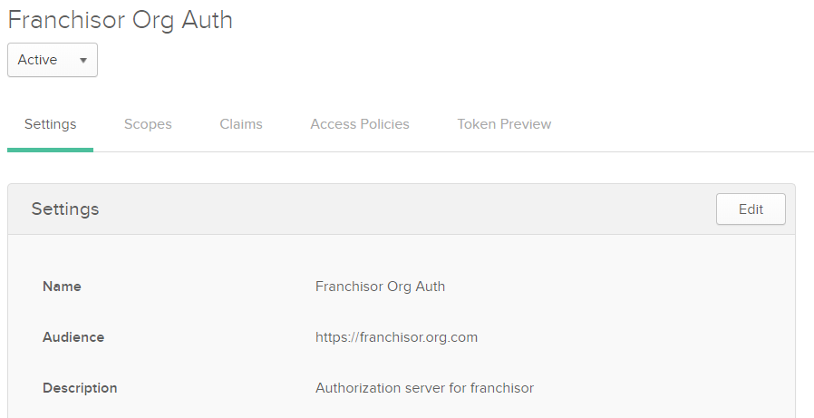

<h2>Table of Contents</h2>

<ul>
<li><a href="#sec-1">1. Introduction</a></li>
<li><a href="#sec-2">2. Prerequisites</a></li>
<li><a href="#sec-3">3. Build and Deploy MVC Web Applications</a></li>
<li><a href="#sec-4">4. Setting up Okta</a></li>
<li><a href="#sec-5">5. Run and Test Web Applications</a></li>
</ul>

# Introduction
Introduction TODO

# Prerequisites
Before you get started, you'll need to install or set up the
software and services below:

1.  Download and install [Visual Studio Community](https://www.visualstudio.com/downloads/)     
    At the time Visual Studio 2017 is the most recent version of Visual Studio available.

    

2.  Sign up for [Okta Developer Edition](http://developer.okta.com/).    
    You'll need an Okta *organization* of your own to use as you follow this gude. After activating your account, log in to it. If you just created an account, you'll see a screen similar to the one below. Click on **< > Developer Console** in the top-left corner and switch to the Classic UI.
    
     

3.  *Optional:* Sign up for a [free trial of Microsoft Azure](http://azure.microsoft.com/en-us/pricing/free-trial/).
    
    This isn't required. You can run sample applications from your computer. However, you need to host login pages on a public-facing Website. Azure is the easiest place to do that.

# Build and Deploy MVC Web Applications
TODO - Deployment Instructions for Web Applications

# Setting up Okta's Sandbox

1. Create a Custom Authorization Server
2. Configure Identity Providers (Login Pages)
3. Add User Accounts (People)
4. Create Groups
5. Configure OpenID Connect and SAML2 applications

## Step 1. Create a Custom Authorization Server ##

Okta allows you to create custom OAuth 2.0 authorization servers. Create a new custom authorization server for this application.

1. Go to Security - API - Authorization Servers
2. Click on **"Add authorization server"** button

	

3.  Provide below information and click on Save button.

	* Name: Franchisor Org Auth
	* Audience: https://franchisor.org.com
	* Description: Authorization server for franchisors

4.  It will add a custom authorization server.

	

5.  Access Policies:

	By default, there is no access policies. We will add access policies for our sample application later.

# Run and Test Web Applications
TODO - Run and Test Web Applications
