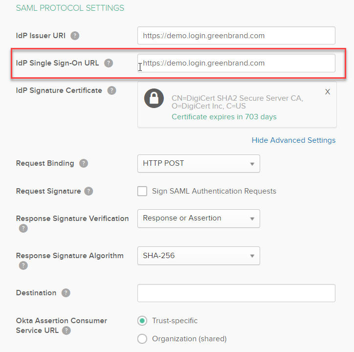
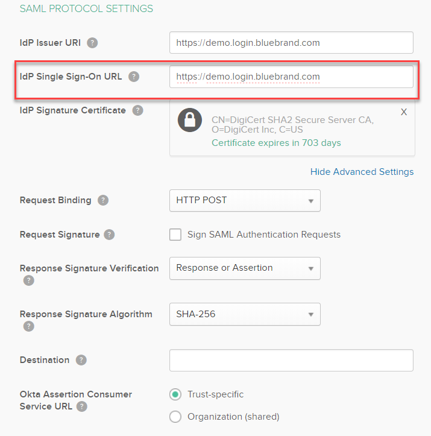
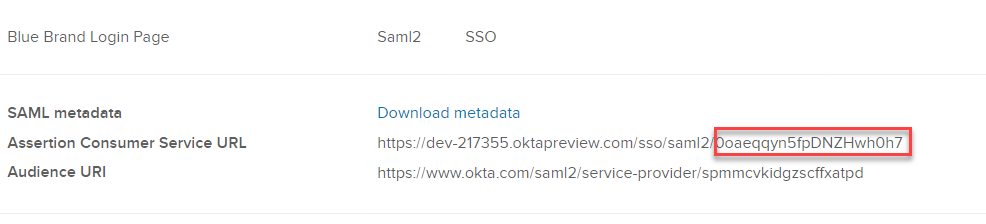

<h2>Table of Contents</h2>

<ul>
<li><a href="#sec-1">A. Introduction</a></li>
<li><a href="#sec-2">B. Prerequisites</a></li>
<li><a href="#sec-3">C. Build MVC Web Applications</a></li>
<li><a href="#sec-4">D. Setting up Okta's Preview Sandbox</a></li>
<li><a href="#sec-5">E. Configure, Deploy and Run Web Applications</a></li>
</ul>

# A. Introduction
**TODO**

# B. Prerequisites
Before you get started, you'll need to install or set up the
software and services below:

1.  Download and install [Visual Studio Community Edition](https://www.visualstudio.com/downloads/)     
    At the time, Visual Studio 2017 is the most recent version of Visual Studio available.

    
	 

2.  Sign up for [Okta Developer Edition](http://developer.okta.com/).    
    You'll need an Okta *organization* of your own to use as you follow this gude. After activating your account, log in to it. If you just created an account, you'll see a screen similar to the one below. Click on **< > Developer Console** in the top-left corner and switch to the Classic UI.
    
     
	 

3.  *Optional:* Sign up for a [free trial of Microsoft Azure](http://azure.microsoft.com/en-us/pricing/free-trial/).
    
    This step is not required. You can run sample applications from your computer. However, if you want to host Branded Login pages and Web applications on a public-facing Website then Azure is the easiest place to do that.
	 
	 
	 

# C. Build MVC Web Applications
TODO - Deployment Instructions for Web Applications

# D. Setting up Okta's Preview Sandbox

1. Create a Custom Authorization Server
2. Configure Identity Providers (Login Pages)
3. Add User Accounts (People)
4. Create Groups
5. Configure OpenID Connect and SAML2 applications

## Step 1. Create a Custom Authorization Server ##

Okta allows you to create custom OAuth 2.0 authorization servers. Create a new custom authorization server for this application.

1. Go to **Security → API → Authorization Servers**
2. Click on **"Add authorization server"** button

	

3.  Provide below information and click on Save button.

	* Name: Franchisor Org Auth
	* Audience: https://franchisor.org.com
	* Description: Authorization server for franchisors

4.  It will add a custom authorization server.

	

5.  Access Policies:

	By default, there is no access policies. We will add access policies for our sample application later.

## Step 2. Create Identity Providers for each brand ##

Okta allows you to create Identity Providers to manage federations with external Identity Providers (IdP). Each identity provider (IdP) requires some setup. For this application, we will create an Identity Provider for each branded login page.

1. Go to Security -> API -> Identity Providers
	

### 2.1	Create Identity Provider for "Green Brand Login Page" ###
1. Click on **"Add Identity Provider"** button
2. Select “Add SAML 2.0 IdP”
	 
	
	  
3. Provide fields for new Identity Provider
	* Name: Green Brand Login Page
	* IdP Username: idpuser.subjectNameId
	* Filter: Unchecked
	* Match against: Okta Username
	* If No match is found: Redirect to Okta Sign-in Page
	* SAML Protocol Settings:
	* IdP Issuer URI: Provide URL for Green branded Login Page. 
		For Example: https://login.greenbrand.com
	* IdP Single Sign-on URI: Provide URL for Green brand Login Page URL. 
		For Example: https://login.greenbrand.com
	* Request Binding: HTTP POST
	* Request Signature: Unchecked
	* Rest of the fields : Default Values
	
	 
	
	 
4.  It will create a new SAML 2.0 Identity Provider
	 
	
	 

### 2.2	Create Identity Provider for "Blue Brand Login Page" ###
1. Click on **"Add Identity Provider"** button
2. Select “Add SAML 2.0 IdP”
	
3. Provide fields for new Identity Provider
	* Name: Blue Brand Login Page
	* IdP Username: idpuser.subjectNameId
	* Filter: Unchecked
	* Match against: Okta Username
	* If No match is found: Redirect to Okta Sign-in Page
	* SAML Protocol Settings:
	* IdP Issuer URI: Provide URL for Blue branded Login Page. 
		For Example: https://login.bluebrand.com
	* IdP Single Sign-on URI: Provide URL for Blue brand Login Page URL. 
		For Example: https://login.bluebrand.com
	* Request Binding: HTTP POST
	* Request Signature: Unchecked
	* Rest of the fields : Default Values
	  
	
	 
	
	 
4. It will create a new SAML 2.0 Identity Provider
	 
	
	 

## Step 3. Enabling CORS (Trusted Origins) ##
In Okta, CORS (Cross-Origin Resource Sharing) allows JavaScript hosted on your websites to make an XHR to the Okta API with the Okta session cookie. Every website origin must be explicitly permitted via the administrator UI for CORS. You have to enable CORS for the Branded Login pages.

**Go to Security → API → Trusted Origins**

### 3.1 Add CORS for Green Brand Login Page ###
- Click on **Add Origin**
	* Name: Green Brand Login
	* Origin URL: Provide Branded Login Page URL e.g. https://login.greenbrand.com
	* Type: CORS [Checked] Redirect [Unchecked]
- Click on **Save** button
	 
	
	 
### 3.2 Add CORS for Blue Brand Login Page ###
- Click on **Add Origin**
	* Name: Blue Brand Login
	* Origin URL: Provide Branded Login Page URL e.g. https://login.bluebrand.com
	* Type: CORS [Checked] Redirect [Unchecked]
- Click on **Save** button
	 
	
	 
	Now, you should have **two CORS** in the list of Origins
	 
	
	 

## Step 4. Create Test Accounts (Add Person) ##
Now, we will add two test accounts in Okta. Use the People page to add test users.

Go to **Directory → People**

### 4.1 Add Test User Account for Green Brand ###
Enter a test user account for Green Brand. For Example: John.Doe@greenbrand.com

- Click on **Add Person**
	* First Name: John
	* Last Name: Doe
	* Username: John.Doe@greenbrand.com
	* Primary Email: John.Doe@greenbrand.com
	* Password: set by admin
	* Password: provide value
	* [Unchecked] User must change password on first login 
	 
	
	 

### 4.2 Add Test User Account for Blue Brand ###
Enter a test user account for Green Brand. For Example: Jane.Doe@bluebrand.com

- Click on **Add Person**
	* First Name: Jane
	* Last Name: Doe
	* Username: Jane.Doe@bluebrand.com
	* Primary Email: Jane.Doe@bluebrand.com
	* Password: set by admin
	* Password: provide value
	* [Unchecked] User must change password on first login 
	 
	
	 
	Go to Directory -> People. Now, you should see both test accounts.
	 
	
	 

## Step 5. Create Groups ##
Its easier to manage users and applications by creating groups. Now, we will create two brand groups and add test accounts to those groups. 

Go to **Directory → Groups** 

### 5.1 Add GreenBrand Group ###
Create a group for Green Brand users.

- Click on **Add Group**
	* Name: GreenBrand Group
	* Description: Users belong to Green Brand
	 
	
	 
- Assign John.Doe@GreenBrand.com to GreenBrand Group
	 
	
	 
 

### 5.2 Add BlueBrand Group ###
Create a group for Blue Brand users.

- Click on **Add Group**
	* Name: BlueBrand Group
	* Description: Users belong to Blue Brand
	 
	
	 
- Assign Jane.Doe@BlueBrand.com to BlueBrand Group
	 
	
	 
- Go to Directory -> Groups, you should be able to see both groups (with one user member)
	 
	
	 

## Step 6. Add OpenID Connect and SAML 2.0 Applications ##
Okta allows you to configure OpenID Connect or SAML2 Web applications. 

Go to **Applications → Applications**

### 6.1 Add OpenID Connect Branded Application ###
Lets first add OpenID connect branded Web Application.

- Click on **Add Application** button
	 
	
	 	
- Click on **Create New App** button
	 
	
	 
- New Application Integration
	
	* Platform: Web
	* Sign on Method: OpenID Connect
	 
	
	 
- Provide OpenID Connect Application Integration details

	* Application Name: OpenID Connect WebApp
	* Application Logo: [optional]
	* Login Redirect URIs: provide Login URL for application 
		e.g. https://oktane2018openidconnect.azurewebsites.net/
	* Logout Redirect URIs: provide Logout URL for application
		e.g. https://oktane2018openidconnect.azurewebsites.net/
		 
		
		 
- Edit Application Configuration:

	* Select Grant Types: 
		* Authorization Code
		* Refresh Token 
		* Implicit (Hybrid) - Allow ID Token, Allow Access Token
	* Click on **Save** button to save changes.
	* Note: Client Credentials are needed for application configuration
	 
	
	 
	
	 
- Assign application to groups:

	* BlueBrand Group
	* GreenBrand Group
	 
	
	 
- Go to Applications List. You will see newly added application.
	 
	
	 
- Add Access Policy for application:
	* Go to Authorization Server.
	* Go to Security → API
	* Select Authorization server
	 
	
	 
- Go to Access Policies under Authorization Server
	* Add New Access Policy (if not already exists)
	* Click on **Add Policy** button.
	 
	
	 
- Provide information for Access Policy

	* Name: OpenID Connect WebApp Policy
	* Description: Access Policy for OpenID Connect WebApp
	* Select the **OpenID Connect Web App**
	 
	
	 
- Add User Access Rule for OpenID Connect Web Application
	* Rule Name: User Access Rule
	 
	
	 
- Review Access Policy for the OpenID Connect Web Application
	 
	
	 
### 6.2 Add OpenID Connect Client Proxy Application for SAML2 Applications ###
### 6.3 Add SAML 2.0 Branded Applications ###
#### 6.3.1 Configure SAML 2.0 Green Brand Application ####
#### 6.3.2 Configure SAML 2.0 Blue Brand Application ####

# E. Configure, Deploy and Run Web Applications
TODO - Run and Test Web Applications